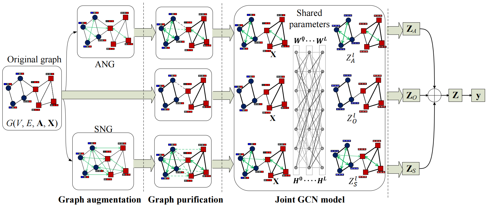

# GREF
A PyTorch implementation of "Graph Augment against Structural Poisoning Attacks via Structure and Attribute Reconciliation".
## Abstact
Recent years have witnessed the great success of graph neural networks (GNNs) in various graph data mining tasks. However, studies demonstrate that GNNs are vulnerable to imperceptible structural perturbations. Carefully crafted perturbations of few edges can significantly degrade the performance of GNNs. Many useful defense methods have been developed to eliminate the impacts of adversarial edges. However, existing approaches ignore the mutual corroboration effects of structures and attributes, which can be used for graph augment. This paper presents GAF, a novel graph augment framework defending GNNs against structural poisoning attacks via structure and attribute reconciliation. GAF first constructs two auxiliary graphs, including  an attributive neighborhood graph and a structural neighborhood graph, to augment the original one. We propose a novel graph purification scheme to prune irrelevant edges and assign the rest edges with different weights based on both node attributes and graph structures. This significantly mitigates the inconsistency between structural and attributive data, reducing the impacts of adversarial and noisy edges. Then, a joint graph convolutional network (GCN) model is developed to encode the three graphs for representation learning. Experimental results show that GAF outperforms state-of-the-art approaches against various adversarial attacks and exhibits great superiority for attacks with high perturbation rates. 

## Requirements and Installation:
To run the code, first you need to install DeepRobust:
```
pip install deeprobust
```
You can see requriements in https://github.com/DSE-MSU/DeepRobust/blob/master/requirements.txt

## Run the code
After installation
```
python run_gaf.py --dataset cora --attack meta --ptb_rate 0.25
```
or
```
python run_gaf.py --dataset cora --attack nettack --ptb_rate 5.0
```
or
```
python run_gaf.py --dataset cora --attack random --ptb_rate 0.2
```